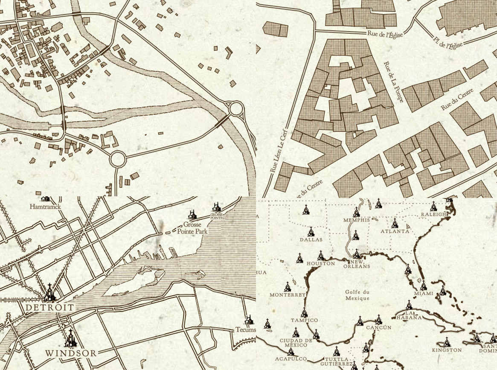
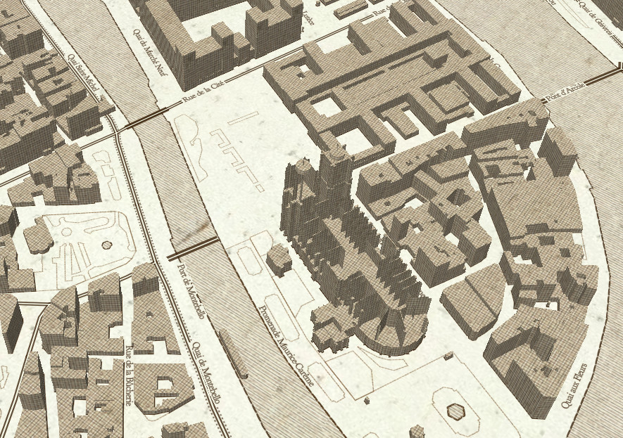

# Cassini GL Style

A Mapbox GL style using the vector tile schema of OpenMapTiles.
Based on historic [Cassini map](https://en.wikipedia.org/wiki/Cassini_map) style.

This project is the Vector version derivated from old CartoCSS version [osm-cassini-carto](https://github.com/makinacorpus/osm-cassini-carto).

## Preview

[Browse the map](https://makinacorpus.github.io/cassini-gl-style/#11.11/43.6019/1.4356)

## 3D variant

Make visible layer `building-3D-background` and `building-3D-texture`.

